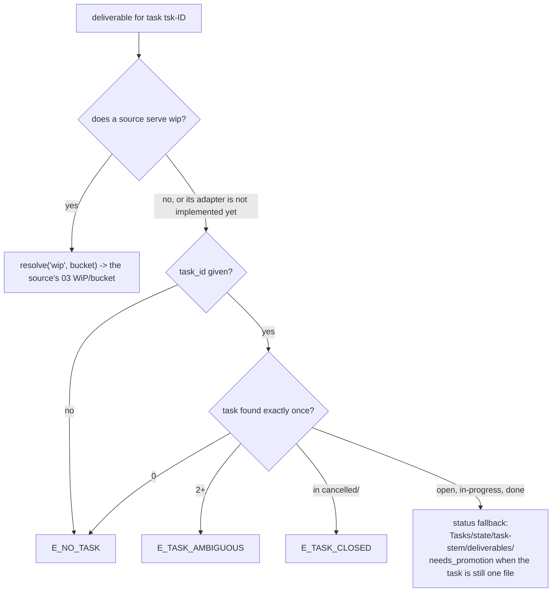
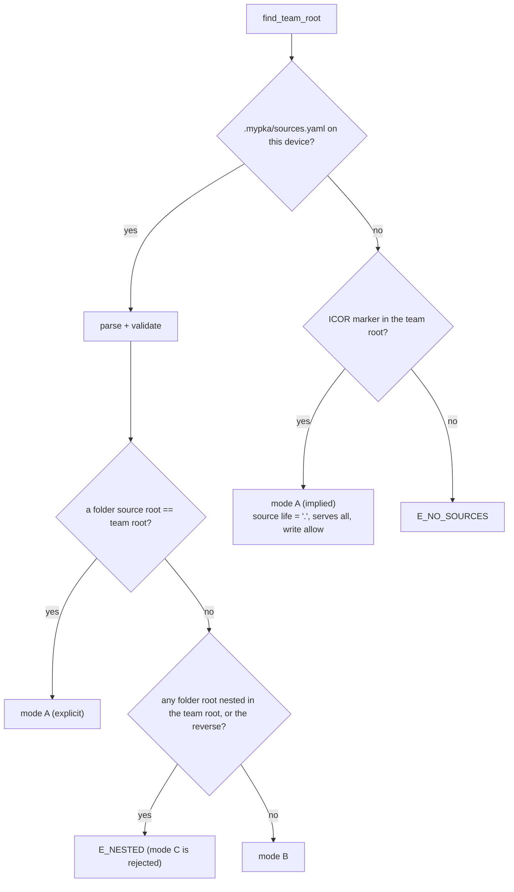

# GL-1013 Sources and the resolver: how the team finds the content it works on

**Kind:** architecture decision record. **Status:** accepted 2026-09-24, amended the same day (`--tool`, `W_EXPOSES_UNKNOWN`,
`harness.json` as team state; the step 5 security review's findings F6 to F12; its three LOW residuals and the step 9
compatibility report, section 8.1). **Scope:** myPKA 6.0.0 (folder adapter), with the `mcp` and `rest` kinds reserved for a later 6.x release.

## The decision

The team addresses **concepts**, never room paths. One file per device, `.mypka/sources.yaml`, binds each content concept
to exactly one source and one write home. One stdlib-only module, `06 AI Team/AI Team Knowledge/Scripts/resolve.py`, is the
only code that turns a concept into a place and the only code that finds the myPKA root. Team memory (AI Sessions, Session
Logs, Tasks, Agents, team knowledge, team state) is not configurable: it always lives under the myPKA root. `wip` belongs to
the content source. Where no source exposes it, a deliverable attaches to its task. Mode A (myPKA unpacked into the ICOR for
Life folder) needs no `sources.yaml` and behaves as before the split. Mode B (myPKA in its own folder next to the source)
needs one.

## Options considered

| Option | Verdict | Why |
|---|---|---|
| One `VAULT_ROOT` variable, room names stay in the code | rejected | Splits the root but still hardcodes every room name. A remote source can never be served. |
| A `--rooms` flag on every script | rejected | 27 root sites times N flags. Drift on the first edit. |
| **`sources.yaml` + one resolver** | **chosen** | One place to read, one place to test, and the rooms stay one constant each. |
| A universal note or block model over every PKM tool | rejected (anti-pattern) | Years of adapter churn. Concepts are containers; a source maps containers, not blocks. |
| Symlink the ICOR rooms into the myPKA folder | rejected | A guard sees two paths for one file, and it cannot reach a remote source. |

## 1. Terms

- **Team root:** the folder that holds `AGENTS.md` and `06 AI Team/Agents/`. The AI session starts here, in both modes.
- **Source:** where content lives: a local folder (6.0.0), an MCP server or a REST API (a later 6.x release).
- **Concept:** a container the team reads or writes, named by id (`journal`, `wip`). **Slot:** a named part of a concept
  (`wip/operations`).
- **Home:** where a concept lives inside its source. **Write home:** the one home a concept is written to. Every concept
  has exactly one.
- **Binding:** the resolved table concept -> source + home + policy, built from `sources.yaml` or implied (mode A).

## 2. The concepts

### 2.1 Content concepts (`icor-concepts/1`, served by a source)

The ids and default homes below are the input to the `icor-concepts/1` schema. Once that schema file lands, it is the
single source for slots and fields, and this table links to it.

| id | Default home in an ICOR for Life folder | Slots | Max write scope | Needs |
|---|---|---|---|---|
| `scratchpad` | `00 Daily Scratchpad` | none | `frontmatter` | The body is never edited by the team (GL-1001). A processed stamp is frontmatter. |
| `inbox` | `01 Inbox` | `outer_world`, `outer_world_archive`, `scanner` | `full` | `move` to archive |
| `planner` | `02 Planner` | `habits`, `routines`, `weeks` | `frontmatter` | Machine-tended by the Planner plugin. The team only sets link properties. |
| `wip` | `03 WiP` | `workstreams`, `ai_team`, `projects`, `operations`, `archive` | `full` | Fallback `task_attachment` (2.3) |
| `journal` | `04 Inner World/Journal` | none (`YYYY/MM` inside) | `full` | |
| `notes` | `04 Inner World/Notes` | `highlights` | `full` | |
| `people` | `04 Inner World/Contacts/People` | none | `full` | |
| `companies` | `04 Inner World/Contacts/Companies` | none | `full` | |
| `key_elements` | `04 Inner World/My Life/Key Elements` | none | `full` | |
| `goals` | `04 Inner World/My Life/Goals` | none | `full` | |
| `projects` | `04 Inner World/My Life/Projects` | none | `full` | |
| `habits` | `04 Inner World/My Life/Habits` | none | `full` | |
| `topics` | `04 Inner World/My Life/Topics` | none | `full` | |
| `journey_notes` | `04 Inner World/ICOR Journey Notes` | none | `full` | |
| `assets` | `05 Assets` | `images`, `audio`, `documents` | `full` | `binary` |
| `databases` | `07 Databases` | none | `full` | `binary` |
| `templates` | `06 AI Team/AI Team Knowledge/Templates` | none | `none` | Entity templates ship with ICOR |
| `life_guidelines` | `06 AI Team/AI Team Knowledge/Guidelines` (GL-1001, 1002, 1003, 1006, 1007, 1010, 1011) | none | `none` | |
| `life_state` | `.icor-for-life/scripts` | none | `none` | `state`. Holds `snapshot.json` and `quality.json`, written by the source's own scripts. |

ICOR scripts the team calls (`life-snapshot.py`, `find-entity.py`, `new-entity.py`, `new-journal-entry.py`, `planner-week.py`,
`check-quality.py`, `link-dates-to-daily-notes.py`, `stamp-processed.py`, `new-base.py`, `open-in-obsidian.py`,
`set-property.py`, `check-bases.py`, `validate-scaffold.py`, `test-life-snapshot.py`) are not concepts. They are **tools**, found with `resolve_tool(name)`
(or `resolve.py --tool NAME` from a shell) on a source that has the `tools` capability. The list matches the ICOR
manifest's `tools` map.

### 2.2 Team concepts (fixed under the team root, never in `sources.yaml`)

| id | Home under the team root | Slots |
|---|---|---|
| `agents` | `06 AI Team/Agents` | |
| `sops`, `workstreams`, `guidelines`, `skills`, `scripts` | `06 AI Team/AI Team Knowledge/<SOPs, Workstreams, Guidelines, Skills, Scripts>` | |
| `tool_profiles` | `06 AI Team/AI Team Knowledge/Tool Profiles` | |
| `expansions` | `06 AI Team/Expansions` | |
| `ai_sessions` | `06 AI Team/AI Sessions` | |
| `session_logs` | `06 AI Team/AI Team Knowledge/Session Logs` (`YYYY/MM` inside) | |
| `tasks` | `06 AI Team/AI Team Knowledge/Tasks` | `open`, `in_progress`, `done`, `cancelled` |
| `task_deliverables` | `Tasks/<state>/<task-stem>/deliverables` | (2.3). Takes a task: `resolve('task_deliverables', task_id=...)`, `resolve.py task_deliverables --task ID`; no task is `E_NO_TASK` |
| `team_state` | `.mypka/state` | `session.json`, `receipts/`, `harness.json` (all three moved from `.icor-for-life/scripts/`) |
| `expansion_receipts` | `.mypka/expansions` | used in mode B since 6.0.2; mode A keeps `.icor-for-life/expansions` until pack schema 2. The one answer is `expansion_receipts_dir(root)` in `resolve.py` |
| `team_config` | `.mypka` | `VERSION`, `manifest.json`, `sources.yaml` |

In mode A the team's `Guidelines/` and `Scripts/` folders are the same folders that hold `life_guidelines` and the ICOR
tools. That is expected: two concepts, one folder, no conflict, because the team never writes a `life_*` file.

The test for `team_state` versus `life_state` is the writer. A file written by a team script (`session-start.py`,
`checkpoint.py`, `scaffold-init.py`) is team state and lives under `.mypka/state/`. A file written by the source's own
scripts (`life-snapshot.py`, the life half of `check-quality.py`) is `life_state`. `harness.json` is written by
`scaffold-init.py doctor` and describes the team's hosts, hooks and guards, so it is team state. Readers of it (the Scaffold
Check plugin) follow the move.

### 2.3 `wip` and the task-attachment fallback



- The fallback is declared, never inferred. `task_attachment` is the default and the only legal value for `wip` in 1.x.
- A task id is the task's **slug**, `[a-z0-9][a-z0-9-]*`, optionally with `.md`: never a path, never a pattern. It must
  match exactly one file under `Tasks/<state>/`, and a file inside a `deliverables/` folder is never a task. One lookup,
  `locate_task()` in `resolve.py`, serves the fallback and `new-task.py` alike (security review F6, F11).
- A task with no deliverable stays one file. It becomes a folder `Tasks/<state>/<task-stem>/<task-stem>.md` plus
  `deliverables/` on its first attachment. The resolver reports `needs_promotion` and never moves anything; `new-task.py`
  does the promotion. The folder travels with the task through `open/`, `in-progress/` and `done/YYYY/MM/`.
- Mode A always serves `wip`, so no mode A vault ever takes this path. Zero migration.

### 2.4 Writing a concept inside an SOP, a Workstream or a contract

Procedures name a place as `concept:<id>[/<slot>][/<rest>]`, for example `concept:inbox/outer_world` or
`concept:wip/operations/2026-09-24-import-notion/`. Every script that takes a vault path also takes a `concept:` ref and
passes it through `resolve_ref()`. Session start prints the binding table once (about 20 lines), so the agent reads the
places without a call per step. No room literal appears in a procedure's call signature. A procedure that runs a source's
tool gets its path from `resolve.py --tool NAME`, never from a room literal.

## 3. `sources.yaml`, schema 1

Location: `<team root>/.mypka/sources.yaml`. **Per device.** Obsidian Sync does not carry dot folders (verified, section 13),
and a folder root is a device path anyway. Mode A needs no file. Mode B needs one.

**The file is guard-protected** (security review F8, approved by Tom 2026-09-24, `f8s`). It decides where the team writes
and whether it asks first, so `write-guard.py` lists it in `WIRING_EXACT`: an Edit that turns `write: ask` into `allow`
is blocked like an edit to the hook wiring. **Onboarding writes the first one with the documented one-call unlock**, from
the team root, in one shell call:

```
ICOR_UNLOCK_WRITES=1 cp .mypka/sources.mode-b.yaml.example .mypka/sources.yaml
```

The prefix stands the guard down for the one command **segment** it prefixes, and the guard logs it. Every other segment
of the same command is judged as usual: `ICOR_UNLOCK_WRITES=1 cp ... .mypka/sources.yaml; echo x > AGENTS.md` blocks the
second part (security review residual 3). A `bash -c` program under the prefix inherits it; `export
ICOR_UNLOCK_WRITES=1` covers only the segments after it, never out of a `( ... )` subshell.

**The two examples are guard-protected too** (residual 2). `.mypka/sources.mode-b.yaml.example` and
`.mypka/sources.yaml.example` sit in `WIRING_EXACT` beside `sources.yaml`, because the unlock copies them: an unguarded
example edited to `write: allow` would ride the logged, legitimate copy into the binding. Chosen over a manifest hash
check in the copy: the onboarding copy is one `cp`, so a hash check would need a new script (a new runtime for the
security gate), while one more guard entry reuses the rule, the unlock and the red tests that already exist. A release
that ships a new example writes it with the unlock, like any other wiring file.

When the ICOR folder is not the sibling
`../icor-for-life`, the member changes `root:` in a text editor, or the agent makes that one change in a single shell call
with the same prefix, after showing the new line. Chosen over a setup script: `resolve.py` never writes (section 9), and a
new script would be a new runtime for the security gate, where the unlock is already built, red-tested and logged.

```yaml
schema: 1                          # required, integer: this file's format

sources:                           # required, one or more
  <source-id>:                     # [a-z][a-z0-9_]{0,31}
    kind: folder                   # required: folder | mcp | rest
    role: source                   # optional: source (default) | enricher. An enricher serves no concept (a later 6.x release).
    root: "../icor-for-life"       # folder only, required: relative to the TEAM ROOT, absolute, or ~
    server: notion                 # mcp only, required: the server name in .mcp.json
    base_url: "https://..."        # rest only, required
    auth_env: NOTION_TOKEN         # mcp/rest: an env-var NAME, never a value (an AWS key id shape is refused)
    implements: "icor-concepts/1"  # folder: read from <root>/.icor-for-life/manifest.json; used here only when that file is absent
    serves: all                    # required: all | [concept, ...]
    except: [journal]              # optional, only with serves: all
    homes:                         # optional: per-concept home override (a folder path inside root, or a remote locator)
      wip: "03 WiP"
    capabilities: [read, list]     # optional: NARROWS the kind's maximum, never widens it
    write: ask                     # optional: deny | ask | allow. Default ask. allow only on kind folder.

fallbacks:                         # optional
  wip: task_attachment             # the only value in 1.x, and the default
  missing_capability: degrade      # degrade (default) | refuse
```

Rules the resolver enforces:

1. **One write home per concept.** After `serves`, `except` and team concepts are applied, every content concept has zero
   or one source. Two is `E_DOUBLE_HOME`. There is no precedence between sources.
2. **Team concepts cannot be bound.** Naming one in `serves`, `except` or `homes` is `E_TEAM_CONCEPT_REBOUND`.
3. **Unknown keys and unknown concept ids are errors**, not warnings. A typo must not quietly unbind a concept. This rule
   covers the member's own file. A source manifest's `exposes` list is the source's claim, not the member's, and an unknown
   id there is the warning `W_EXPOSES_UNKNOWN` (section 9).
4. **No `requires` here.** What myPKA needs (`icor-concepts >=1 <2`) lives in `.mypka/manifest.json`, which the member does
   not edit. A source says what it implements; the resolver compares the two.
5. **The reader is a strict subset of YAML**, parsed by about 100 lines of stdlib inside `resolve.py`: block mappings,
   plain or quoted scalars, flow lists of plain scalars, `#` comments. No flow mappings, anchors, tags, multi-document
   files or duplicate keys (a duplicate is `E_SOURCES_PARSE`). PyYAML is never imported: it is not on every Python this
   runs under, and a guard that imports it reports a failure when it never ran.

## 4. Adapter kinds and capabilities

| Kind | Ships | Addresses a place as | Maximum capabilities |
|---|---|---|---|
| `folder` | 6.0.0 | absolute `Path` | all below; `tools` and `state` only when the root carries the ICOR marker |
| `mcp` | a later 6.x release | opaque locator string | `read list search frontmatter links create update set_property move` |
| `rest` | a later 6.x release | opaque locator string | same as `mcp` |
| `team` | 6.0.0, internal | absolute `Path` under the team root | all; not declarable |

| Capability | Means |
|---|---|
| `read` | open one item by home-relative id |
| `list` | enumerate a container |
| `search` | full-text query inside a concept |
| `frontmatter` | structured properties per GL-1002 |
| `links` | links and backlinks resolve (without it, the link-first rule degrades) |
| `create` | new item in a container |
| `update` | edit an item's body |
| `set_property` | edit frontmatter only |
| `move` | move an item between containers of the same source (inbox to archive) |
| `binary` | store a non-text file (assets, databases) |
| `tools` | the source's own scripts can be run locally (`resolve_tool`, `resolve.py --tool`) |
| `state` | the source exposes machine-layer JSON (`life_state`) |

**`delete` is not a capability in 1.x.** Declaring it is `E_CAPABILITY_OVERCLAIM`, like any capability above its kind's
maximum. Effective capabilities = kind maximum AND declared list (if any) AND what the source's manifest reports.

## 5. Write policy

- `write` is per source: `deny`, `ask` (default) or `allow`. `allow` is legal on `kind: folder` only; on `mcp` or `rest`
  it is `E_POLICY`.
- **The one implied exception (RULED 2026-09-24, `y4h`):** mode A with no `sources.yaml` binds the co-located folder with
  `write: allow`, which is exactly how the team worked before the split. A member-written `sources.yaml` makes `ask` the
  default again. Applied on the team's recommendation under Tom's instruction "roll out the myPKA split based on the
  recommendations of the team".
- Each concept also carries a **max write scope** from the schema (2.1): `none`, `frontmatter` or `full`. A write above it
  is `E_POLICY`, whatever the source policy says.
- `ask` means the caller shows a diff (or the planned file list) and waits for a yes before writing. The resolver never
  prompts. It returns the policy, and the caller or adapter enforces it.
- **Writes never degrade.** A missing write capability is always `E_CAPABILITY`, even when `missing_capability: degrade`.

## 6. Finding the myPKA root

**Marker:** a folder holding the file `AGENTS.md` and the folder `06 AI Team/Agents/`. It is not `.mypka/`, because dot
folders do not arrive on a second device through Obsidian Sync. `06 AI Team/Agents/` keeps an ICOR folder that ships its
own `AGENTS.md` from being mistaken for the team root. The folder name is one constant in `resolve.py`, so a later rename is
one edit.

**Order, first hit wins:**

1. an explicit root (`--root`, or `find_team_root(explicit=...)`), taken as given; without the marker it carries
   `W_ROOT_EXPLICIT_UNMARKED`, because an ICOR folder named this way loads as implied mode A with `write: allow`
   (security review F12);
2. `CLAUDE_PROJECT_DIR`, **only if it holds the marker**; otherwise ignored with `W_ROOT_ENV_IGNORED`;
3. walk up from the calling script's own file;
4. walk up from the hook payload's `cwd` (hooks only, the path hosts without a project variable already use);
5. none of these: `E_NO_ROOT`.

**The sites this replaces** (grep of `lab/mypka` Scripts, 2026-09-24: 13 fixed-root sites, plus 2 that already walk):

| # | Script | Line | Today | Becomes |
|---|---|---|---|---|
| 1 | `add-mcp-server.py` | 48 | `Path(__file__).resolve().parents[3]` | `find_team_root().path` |
| 2 | `check-hire.py` | 95 | `HERE.parents[2]` as the `--root` default | default `None`, then `find_team_root(explicit=a.root)` |
| 3 | `check-onboarding.py` | 14 | `parents[3]` of the file | as 1 |
| 4 | `checkpoint.py` | 104, 109 | `a.root or parents[3]`; `MACHINE = ROOT/.icor-for-life/scripts` | as 2; `MACHINE = team_path("team_state")` |
| 5 | `expansion-pack.py` | 200 | `args.root or parents[3]` | as 2 (the receipt folder moves with pack schema 2) |
| 6 | `import-file.py` | 19 | `parents[3]` of the file | as 1; destinations through `resolve_path("assets", slot)` and `resolve_path("notes")` |
| 7 | `mint-agent-ids.py` | 83 | `HERE.parents[2]` default | as 2 |
| 8 | `new-agent.py` | 100 | `HERE.parents[2]` default | as 2 |
| 9 | `new-session-log.py` | 40 | `parents[3]` of the file | as 1; target `team_path("session_logs")` |
| 10 | `new-task.py` | 41 | `parents[3]` of the file | as 1; also owns the task promotion (2.3) |
| 11 | `run-red-tests.py` | 59 | `HERE.parents[2]` | `find_team_root(start=HERE, env={})`: the suite tests its own tree, never one an env names |
| 12 | `session-start.py` | 68, 69 | `CLAUDE_PROJECT_DIR or HERE.parents[2]`; `MACHINE` | `find_team_root()` (same order, now validated); `team_path("team_state")`; `quality.json` through `resolve("life_state")` |
| 13 | `skill-doctor.py` | 68 | `HERE.parents[2]` default | as 2 |
| (a) | `scaffold-init.py` | 142, 1940 | `find_root()`: walk to `AGENTS.md` + `06 AI Team/`; `HARNESS_PATH = ".icor-for-life/scripts/harness.json"` | delegates to `find_team_root()` (marker gains `/Agents`); `harness.json` under `team_path("team_state")` |
| (b) | `write-guard.py` | 513, 834, 855 | `CLAUDE_PROJECT_DIR or payload cwd` | checks a path against **every** root in the binding (security review, step 5). Today a path outside the one root returns `None`, so a write into a sibling source root is not evaluated. |

The `harness.json` contract test in `run-red-tests.py` (line 3455, `_HJ`) names the old path and moves with site (a).

**ICOR scripts are not the team's.** The 11 in `lab/icor-for-life` (`new-base`, `build-scaffold-manifest`, `new-entity`,
`new-journal-entry`, `open-in-obsidian`, `link-dates-to-daily-notes`, `find-entity`, `set-property`, `check-bases`,
`planner-week`, `life-snapshot`) walk up from their own file to the **ICOR marker**: `.icor-for-life/manifest.json`, or
when that dot folder did not sync, the four rooms `00 Daily Scratchpad/`, `01 Inbox/`, `03 WiP/`, `04 Inner World/` side
by side. Step 10 placed the 3 that were unplaced: `validate-scaffold` and `check-quality` went to ICOR (they take their
root from their own file, a fixed parent, or an explicit argument), and `new-progress-report` went to myPKA, where it
resolves the `wip` concept through `resolve.py` like every team script. No ICOR script imports `resolve.py`: an ICOR
folder must run without myPKA.

## 7. `CLAUDE_PROJECT_DIR`

Verified against the vendor docs on 2026-09-24 (section 13):

- Claude Code sets it for **hook processes, stdio MCP servers and plugin LSP servers**, and substitutes `${CLAUDE_PROJECT_DIR}`
  inside a skill. Its value is **the project root where the session started**, and it does not follow a later `cd`.
- It is **not documented for commands the model runs through its shell tool.** A script started that way must not need it.
- Codex CLI documents **no** project-root variable. Its hooks get `cwd` in the payload.

Rules:

1. The AI session starts in the **team root**, in both modes. In mode A that is the one folder. In mode B it is the myPKA
   folder, never the ICOR folder (no `AGENTS.md` there, so the host would load no team).
2. `CLAUDE_PROJECT_DIR` is a **team-root hint**, validated against the marker (section 6, step 2). It is **never** used to
   find a source. Sources come from `sources.yaml` only.
3. Generated hook and skill commands keep `${CLAUDE_PROJECT_DIR}/06 AI Team/...`, braced. They are correct in both modes,
   because hooks and skills live in the team root. The generator needs no change for this ADR.
4. Tests keep using it to point a script at a fixture vault. That is why the variable ranks above the file walk.

## 8. How mode A and mode B resolve



| Call | Mode A, one folder `V/` | Mode B, `P/mypka/` + `P/icor-for-life/` | Mode B, source without `wip` |
|---|---|---|---|
| `resolve("journal")` | `V/04 Inner World/Journal`, allow | `P/icor-for-life/04 Inner World/Journal`, ask | same as mode B |
| `resolve("wip", "operations")` | `V/03 WiP/Operations` | `P/icor-for-life/03 WiP/Operations` | fallback with `task_id`: `P/mypka/06 AI Team/AI Team Knowledge/Tasks/open/<task-stem>/deliverables` |
| `team_path("tasks", "open")` | `V/06 AI Team/AI Team Knowledge/Tasks/open` | `P/mypka/06 AI Team/AI Team Knowledge/Tasks/open` | same |
| `team_path("team_state")` | `V/.mypka/state` | `P/mypka/.mypka/state` | same |
| `resolve_tool("life-snapshot")` | `V/06 AI Team/AI Team Knowledge/Scripts/life-snapshot.py` | `P/icor-for-life/06 AI Team/AI Team Knowledge/Scripts/life-snapshot.py` | `E_CAPABILITY` (no `tools`) or degraded |

Version check for both modes: the source's `implements` (from its manifest, else from `sources.yaml` with
`W_VERSION_UNVERIFIED`) must satisfy `requires` in `.mypka/manifest.json`. Outside the range: `E_SCHEMA_MISMATCH`. Missing
on both sides (the dot folders did not sync): run as `icor-concepts/1` with `W_VERSION_UNVERIFIED`. A second device must
not stop working over a file that sync never carried.

### 8.1 The session-start compatibility report (plan step 9)

`session-start.py` prints the comparison as the first line after the session id, in both modes, from `resolve.check()`
and the two manifests. It never re-implements the version rule; the resolver's `E_SCHEMA_MISMATCH` is the only refusal.

| Answer | When | Exit | Written |
|---|---|---|---|
| `COMPATIBLE` | every concept bound, the source implements `icor-concepts/1` against `requires` `>=1 <2` | 0 | the usual ritual |
| `DEGRADED, missing <ids>` | a concept is unbound, lacks a capability it needs, or falls back; each is named on its own line. A missing `wip` names the k4v fallback (`Tasks/<state>/<task-stem>/deliverables/`) | 0 | the usual ritual |
| `WARN` (with `COMPATIBLE (unverified)` or `DEGRADED`) | `.mypka/manifest.json` or the source's `.icor-for-life/manifest.json` is missing (Obsidian Sync does not carry dot folders): run as `icor-concepts/1`, unverified | 0 | the usual ritual |
| `REFUSED (exit 2), E_SCHEMA_MISMATCH: <detail>` | the source implements a version outside `requires` (`icor-concepts/2`), or `sources.yaml` is not schema 1 | 2 | **nothing**: decided before `session.json`, before any child script, so no `quality.json` and no snapshot |

Where `implements` comes from: mode A, the co-located `.icor-for-life/manifest.json`; mode B, the manifest in the root
`sources.yaml` names, else `sources.yaml`'s own `implements` (marked unverified). Any other binding error keeps the
pre-step-9 behaviour: `compatibility: NOT CHECKED`, the content tools skipped, exit 0. **Host note:** on Claude Code a
SessionStart hook that exits non-zero shows its stderr to the member and adds nothing to the model's context. A refused
start is therefore visible to the member, not to the model; the reason is on both streams for hosts that read either.

## 9. The `resolve.py` contract

Stdlib only. Same interpreter floor and the same import mechanism as the other lab scripts. It **never writes, moves,
creates a folder, opens a network connection or starts a subprocess.** It reads: `sources.yaml`, the manifests, `stat` of
homes, and the `Tasks/` tree for the fallback. It loads once per process; `bindings=` lets tests inject.

```python
class ResolveError(Exception):
    code: str            # one of the E_ codes below
    concept: str | None
    detail: str          # one line, human-readable

@dataclass(frozen=True)
class Root:
    path: Path
    found_by: str        # "explicit" | "env:CLAUDE_PROJECT_DIR" | "walk:file" | "walk:cwd"
    warnings: tuple[str, ...]

@dataclass(frozen=True)
class Resolution:
    concept: str
    slot: str | None
    status: str          # "bound" | "fallback" | "degraded"
    mode: str            # "A" | "B"
    source: str | None   # source id, "team" for team concepts, None on fallback
    kind: str            # "folder" | "mcp" | "rest" | "team"
    path: Path | None    # absolute; set for folder and team
    locator: str | None  # set for mcp and rest
    capabilities: frozenset[str]
    write: str           # "deny" | "ask" | "allow"
    scope: str           # "none" | "frontmatter" | "full"
    fallback: str | None # "task_attachment" when status == "fallback"
    needs_promotion: bool
    missing: frozenset[str]   # asked for in need=, not present (status "degraded")
    warnings: tuple[str, ...]

def find_team_root(explicit=None, *, start=None, env=None) -> Root
def load(root: Root | None = None) -> Bindings
def resolve(concept, slot=None, *, need=(), for_write=None, task_id=None, bindings=None) -> Resolution
    # for_write: None | "frontmatter" | "full"
def resolve_path(concept, slot=None, **kw) -> Path        # E_NOT_A_FOLDER for mcp/rest
def resolve_ref(ref: str, **kw) -> Path                    # "concept:inbox/outer_world/x.md"; the result's real path
                                                           # stays in the source root (bound), the deliverables folder
                                                           # (fallback) or the team root (team concept), else E_ESCAPE
def task_stem(task_id) -> str                              # the slug, or E_NO_TASK
def locate_task(tasks, task_id) -> (str, [(state, Path)])  # exact-name hits under Tasks/<state>/, deliverables/ skipped
def team_path(concept, slot=None) -> Path                  # team concepts only, never configurable
def resolve_tool(name: str, *, bindings=None) -> Path      # needs "tools" on the source serving the life concepts; returns, never runs
def check(bindings=None) -> Report                         # status "compatible" | "degraded" | "refused", per-concept rows
```

**Capability check,** in order: (1) the concept is known; (2) it is bound, or its declared fallback applies; (3)
`need` is a subset of the effective capabilities. If not: `degraded` (returns, lists `missing`) or `E_CAPABILITY` under
`missing_capability: refuse`, and always `E_CAPABILITY` when a write capability is missing; (4) `for_write` passes the
policy and the scope (section 5); (5) a folder home's real path stays inside the source root's real path.

**Fallback declaration:** read from `fallbacks:`; `wip: task_attachment` is the default when omitted. Any other key or value
is `E_BAD_FALLBACK`. A concept bound to a kind whose adapter is not implemented yet (`mcp` or `rest` in 6.0.0) counts as
unbound, with `W_KIND_NOT_IMPLEMENTED`, so `wip` falls back instead of pretending.

| Code | Raised when | CLI exit |
|---|---|---|
| `E_NO_ROOT` | no marker by any route in section 6 | 2 |
| `E_NO_SOURCES` | no `sources.yaml` and no ICOR marker in the team root | 2 |
| `E_SOURCES_PARSE` | outside the YAML subset, duplicate key, unknown key, an `auth_env` that is not a NAME or has an AWS key id's shape (F10) | 2 |
| `E_SCHEMA_MISMATCH` | `schema` not 1, or `implements` outside `requires` | 2 |
| `E_UNKNOWN_CONCEPT` | id or slot not in the schema or the team list | 2 |
| `E_TEAM_CONCEPT_REBOUND` | a team concept named in `sources.yaml` | 2 |
| `E_DOUBLE_HOME` | a concept served by two sources | 2 |
| `E_SOURCE_MISSING` | a folder root that does not exist | 2 |
| `E_NESTED` | a folder root inside the team root (other than `.`), the team root inside it, or two overlapping folder roots | 2 |
| `E_CAPABILITY_OVERCLAIM` | declared capability above the kind's maximum (incl. `delete`) | 2 |
| `E_CAPABILITY` | `need` not met under `refuse`, a write capability missing, or `resolve_tool` / `--tool` on a source without `tools` | 2 |
| `E_POLICY` | `write: allow` on mcp/rest; write on `deny`; write above the concept's scope | 2 |
| `E_ESCAPE` | a home's real path leaves its source root (`..`, a symlink out), or a `concept:` ref's rest does (F9) | 2 |
| `E_UNBOUND` | not bound and no fallback | 2 |
| `E_BAD_FALLBACK` | a fallback other than `wip: task_attachment` | 2 |
| `E_NO_TASK` / `E_TASK_AMBIGUOUS` / `E_TASK_CLOSED` | fallback without a task or with a task id that is not a slug, with 2+ matches, or on a cancelled task | 2 |
| `E_NOT_A_FOLDER` | `resolve_path` on an mcp/rest binding | 2 |

Warnings (never fatal): `W_ROOT_ENV_IGNORED`, `W_VERSION_UNVERIFIED`, `W_KIND_NOT_IMPLEMENTED`, `W_NO_ICOR_MANIFEST`,
`W_EXPOSES_UNKNOWN`, `W_ROOT_EXPLICIT_UNMARKED`.

| Warning | Raised when | Effect |
|---|---|---|
| `W_EXPOSES_UNKNOWN` | a source manifest's `exposes` names a concept id this myPKA's schema does not know | the unknown id is ignored; every known id binds as usual |
| `W_ROOT_EXPLICIT_UNMARKED` | an explicit `--root` has no team-root marker | the root is used as given; `--check` and the calling scripts print the warning |

`W_EXPOSES_UNKNOWN` is a warning, not an error, on purpose. `exposes` is written by the source, not by the member, so it
is not the typo case of section 3 rule 3. Within one major version a newer source (`icor-concepts/1.x`) may expose a
concept an older myPKA has not learned yet. Refusing would stop a working team over an addition it simply cannot use.
Anything outside the major version is still `E_SCHEMA_MISMATCH`.

**CLI:**

- `python3 resolve.py <concept>[/<slot>] [--need a,b] [--write frontmatter|full] [--task ID] [--root PATH] [--json]`
  prints the path (or JSON with `schema: 1`).
- `resolve.py --check [--root PATH] [--json]` prints the binding table.
- `resolve.py --tool NAME [--root PATH]` prints the absolute path of a content source's own script, for example
  `life-snapshot`, found through `resolve_tool`. **It never runs the script.** The caller does, which keeps the module's
  no-subprocess rule intact. This is how a procedure or an agent's shell call gets a tool path without importing Python.

Exit 0 bound (or `--check` compatible, or `--tool` found), 3 fallback, 4 degraded, 2 error, with `E_CODE concept: detail`
as the first stderr line.

## 10. Acceptance: the red tests (step 4)

Every case lives in `run-red-tests.py`, runs on a temp fixture, and is **watched red once** by the mutation in the last
column before it counts (GL-070). Fixtures: **FX-A** is `lab/icor-for-life` and `lab/mypka` merged into one folder, with no
`sources.yaml`. **FX-A-nosync** is FX-A without `.icor-for-life/` and `.mypka/`. **FX-B** is the two lab folders as
siblings, with `sources.mode-b.yaml.example` copied to `.mypka/sources.yaml`. **FX-B-nowip** is FX-B with `wip` absent from
the ICOR manifest's `exposes` and `03 WiP/` removed.

| Id | Fixture | Call | Expected | Watched red by |
|---|---|---|---|---|
| R01 | FX-A | `resolve("journal")`, `resolve("wip")` | `V/04 Inner World/Journal`, `V/03 WiP`; mode A; write `allow`; exit 0 | delete `.icor-for-life/manifest.json` AND one room -> `E_NO_SOURCES` |
| R02 | FX-A | `find_team_root(start=<each of the 13 scripts>)` | equals the old expression's value for every script | mutate the walk to return `start.parent` |
| R03 | FX-A-nosync | `resolve("journal")` | bound, mode A, `W_VERSION_UNVERIFIED`, exit 0 | remove the four-room fallback from the ICOR marker -> `E_NO_SOURCES` |
| R04 | FX-B | `resolve("journal")`, `resolve("wip","operations")` | sibling paths; mode B; write `ask` | point `root` at `../missing` -> `E_SOURCE_MISSING` |
| R05 | FX-B minus `sources.yaml` | `--check` | `E_NO_SOURCES`, exit 2 | (the red is the case) |
| R06 | FX-B-nowip, task in `open/` | `resolve("wip", task_id=ID)` | fallback; `Tasks/open/<stem>/deliverables`; `needs_promotion` true; exit 3 | move the task to `done/2026/09/` -> the path follows the state |
| R07 | FX-B-nowip | `resolve("wip")` with no task | `E_NO_TASK` | |
| R08 | FX-B-nowip, task in `cancelled/` | `resolve("wip", task_id=ID)` | `E_TASK_CLOSED` | |
| R09 | FX-B + `fallbacks: {wip: ai_session}` written in block form | `--check` | `E_BAD_FALLBACK` | |
| R10 | FX-B + a second source with `serves: [journal]`, no `except` | `--check` | `E_DOUBLE_HOME` | add `except: [journal]` -> green, journal on the second source |
| R11 | FX-B + a duplicate `life:` key | `--check` | `E_SOURCES_PARSE` naming the line | |
| R12 | FX-B + `homes: {tasks: "x"}` in block form | `--check` | `E_TEAM_CONCEPT_REBOUND` | |
| R13 | any | `resolve("jornal")` | `E_UNKNOWN_CONCEPT` | |
| R14 | FX-B + `capabilities: [read, delete]` | `--check` | `E_CAPABILITY_OVERCLAIM` | same with `tools` on a `kind: mcp` source |
| R15 | FX-B + a `kind: mcp` source with `write: allow` | `--check` | `E_POLICY` | |
| R16 | FX-A | `resolve("scratchpad", for_write="full")` | `E_POLICY`; `for_write="frontmatter"` passes | |
| R17 | FX-B, `capabilities: [read, list]` | `resolve("notes", need=["search"])` | degraded, `missing={search}`, exit 4; under `refuse`: `E_CAPABILITY` | |
| R18 | FX-B, `capabilities: [read, list]` | `resolve("notes", for_write="full")` | `E_CAPABILITY` even under `degrade` | |
| R19 | FX-B, ICOR manifest `implements: icor-concepts/2` | `--check` | `E_SCHEMA_MISMATCH`, status refused | (this is T5) |
| R20 | FX-B + `homes: {notes: "../../outside"}`; then a symlinked `04 Inner World/Notes` pointing out of the root | `resolve("notes")` | `E_ESCAPE` both times | |
| R21 | FX-B with `root: "./content"` inside the team root | `--check` | `E_NESTED` | |
| R22 | FX-A; `CLAUDE_PROJECT_DIR` = a folder without the marker | `find_team_root()` | root from the file walk, `W_ROOT_ENV_IGNORED` | set it to a second valid fixture -> that fixture wins, `found_by = env` |
| R23 | the script copied to a temp dir outside any tree, env unset | `resolve.py --check` | `E_NO_ROOT`, exit 2 | |
| R24 | FX-A, FX-B, FX-B-nowip | every call above | SHA-256 of every file under both roots identical before and after, no new folder (incl. no `deliverables/`) | plant a `mkdir` in the fallback path |
| R25 | `resolve.py` | run under `python3 -I -S` | runs; no `import yaml` anywhere in the file | |
| R26 | FX-B + a `kind: mcp` source serving `wip` | `resolve("wip", task_id=ID)`, `resolve_path("wip")` | fallback with `W_KIND_NOT_IMPLEMENTED`; `E_NOT_A_FOLDER` | |
| R27 | FX-A, FX-B | `resolve_tool("life-snapshot")` | the ICOR script path in each mode | source with `capabilities: [read, list]` -> `E_CAPABILITY` |
| R28 | FX-B; session hook with `CLAUDE_PROJECT_DIR` = the ICOR sibling | a Write to `P/mypka/AGENTS.md` | write-guard **blocks** (security review verdict, step 5) | green since myPKA `8943919` (the guard checks every root in the binding); watched red on the old `relative()`, which returned `None` for a path outside the one root |
| R29 | FX-A, FX-B | `--check --json` twice | byte-identical output, concepts sorted | shuffle the dict order in the reader |
| R30 | FX-B, ICOR manifest `exposes` gains `future_concept` | `--check`, `resolve("journal")` | `W_EXPOSES_UNKNOWN`; status compatible, exit 0; every other binding unchanged | drop the warning -> red on the missing warning; raise on the unknown id -> red on exit 2 |
| R31 | FX-A, FX-B | `resolve.py --tool life-snapshot` | stdout equals `resolve_tool("life-snapshot")`, exit 0; the tool did not run (no `snapshot.json` written, R24 hashes unchanged) | plant a `subprocess.run` of the tool in the `--tool` branch -> `snapshot.json` appears; source with `capabilities: [read, list]` -> `E_CAPABILITY`, exit 2 |

**Security review cases (step 5, Vex, 2026-09-24).** Same shape: each runs against the shipped scripts and against a
mutant that restores the pre-fix behaviour, and each also went red once against myPKA `8943919`, the tree Vex reviewed.

| Id | Fixture | Call | Expected | Watched red by |
|---|---|---|---|---|
| F6 | FX-A: a task, a promoted task with `deliverables/notes-draft.md`, an ICOR journal note | `new-task.py move AGENTS.md --to done`; `promote <journal note path>`; `move notes-draft`; `move <absolute task path>`; `--root <second fixture> move <its task>` | the four refused, nothing moved; the slug moves; `--root` moves the task in the named root | `find_task` takes any existing file again |
| F6b | two FX-B-nowip | `new-progress-report.py --root <second> --task <stem>` | the task in the named root is promoted, the report lands there | the promote call drops `--root` |
| F7 | FX-A, a folder outside the root, a symlink `03 WiP/Operations/link-out` to it | `new-progress-report.py --wip` with `../../outside`, the absolute path, the symlink | refused, no report outside; `Operations/<folder>` passes | the `--wip` checks removed |
| F8 | FX-B, the write-guard | Edit `write: ask` to `allow` on `.mypka/sources.yaml` (env = team root, then the ICOR sibling); `sed -i`; `cp` over it | exit 2 each; the same Edit with `ICOR_UNLOCK_WRITES=1` and the onboarding `ICOR_UNLOCK_WRITES=1 cp` exit 0 | `sources.yaml` dropped from `WIRING_EXACT` |
| F9 | FX-B, `Notes/escape` a symlink out of the source | `resolve_ref("concept:notes/escape/x.md")` | `E_ESCAPE`; `concept:notes/x.md` resolves | the end-of-ref check removed |
| F10 | FX-B + an mcp source with `auth_env: AKIA...` then `ASIA...` | `--check` | `E_SOURCES_PARSE`; `NOTION_TOKEN` passes | the key-id check removed |
| F11 | FX-B-nowip, task `2026-09-24-demo` | `resolve.py wip --task '2026-09-24-d*'`, `new-progress-report.py --task` and `new-task.py move` with the same pattern | `E_NO_TASK` exit 2, nothing promoted or moved; the slug gives exit 3 | the slug check removed and the lookup globs again |
| F12 | FX-B | `--check --root <the ICOR folder>` | `W_ROOT_EXPLICIT_UNMARKED`; `--root <team root>` does not warn | the warning removed |
| V5R1 | FX-A, FX-B: a `progress-report.md` leaf symlink to `outside/pwn.md` (dangling), and one to an existing outside file | `new-progress-report.py --wip` (create), then `--touch` | refused, nothing written outside; a plain work folder creates and touches | the leaf checks and the no-follow write removed |
| V5R2 | FX-B, the write-guard | Edit `write: ask` to `allow` in each example (env = team root, then the ICOR sibling); `sed -i`; `cp` over it | exit 2 each; the Edit with `ICOR_UNLOCK_WRITES=1` and the onboarding copy exit 0 | the two examples dropped from `WIRING_EXACT` |
| V5R3 | FX-A, FX-B, the write-guard | `ICOR_UNLOCK_WRITES=1 cp ...; echo x > AGENTS.md`, the same with `&&`, a pipe into `tee`, an `export` after the write or inside `( )`, a second-segment `python3 -c` | exit 2 each; the prefixed segment alone, `export` before the write, `bash -c` under the prefix exit 0 | one prefix stands the guard down for the whole command |
| S9 | FX-A and FX-B with `implements: icor-concepts/2`; FX-B-nowip; FX-A, FX-B; FX-A-nosync and FX-B without both manifests | `session-start.py` | REFUSED, exit 2, both streams, tree hashes unchanged; `DEGRADED, missing wip` with k4v; `COMPATIBLE ... icor-concepts/1`, no WARN; WARN naming Obsidian Sync, exit 0, `session.json` written | the refusal off; the wip line skipped; the report dropped; the WARN lines dropped |

**Step 5 verdict (Vex, re-verify 2026-09-24): APPROVED.** F6 to F12 closed at myPKA `b28416c` (with `7bf0783`, ICOR `399f14a`), each re-probed in mode A and mode B, suite 499/499 in both; three LOW residuals go to Mack and block nothing: a `progress-report.md` leaf symlink is still followed out of the wip home, `.mypka/sources.mode-b.yaml.example` is unguarded and is what the unlock copies, and the Bash unlock covers every segment of the command it prefixes.

**Residuals closed (Mack, 2026-09-24):** the leaf symlink is refused and the report is written with `O_NOFOLLOW` (V5R1),
the two examples are in `WIRING_EXACT` (V5R2, section 3), the unlock covers its own segment only (V5R3). Each case went
red against myPKA `fed9564` before it went green; they block nothing and wait for Vex's next pass.

## 11. Eval gate

- **Deterministic gate:** R01 to R31 and F6 to F12 green in `run-red-tests.py`, each watched red once. The release gate (SOP-1016) blocks
  on any red. T2, T3, T4, T5 and T6 of the lab plan run on top.
- **Agent-behavior gate** (the one model-dependent part): on FX-B with `write: ask`, four scenarios (an inbox capture, a
  journal entry, a WiP deliverable, the same deliverable on FX-B-nowip), two hosts (Claude Code, Codex CLI), three runs
  each, so 24 runs. **Pass: 24 of 24.** No write outside a resolved home (file-system diff). No write into an `ask` source
  without a diff shown first (transcript). No content room created under the team root (for example `P/mypka/03 WiP/`). On
  FX-B-nowip the deliverable lands in the task's `deliverables/`. The bar is absolute: every miss is misplaced member data,
  not a quality score.
- No sampled-traffic evaluation: members run locally and there is no production traffic to sample. Re-run the agent
  gate whenever `resolve.py`, the `concept:` notation or a host's major version changes.

## 12. What this ADR does not decide

- The `icor-concepts/1` field and slot schema, and the ICOR manifest's `exposes` and `tools` keys: step 3. This ADR names
  the ids; the schema is the single source once it lands.
- The `mcp` and `rest` adapter specs and the per-source capability matrix: step 21.
- Where `check-quality.py` and `noteio.py` live, and the `.update` updater: **decided outside this ADR.** Step 10 placed
  `check-quality.py` on ICOR and `noteio.py` on myPKA (ICOR carries a pinned copy, `noteio-icor.py`). Step 12 built the
  updater, `mypka-update.py`: it writes only paths a release manifest lists, inside the one target root, and never deletes.
  **Security gate (Vex, step 13 re-review, 2026-09-24): APPROVED.** R1 to R7 verified (myPKA `d71f134` and `3b1f349`,
  ICOR `108a1cf`); P1 to P6 and P8 refuse. P7 stays open by design: a tampered release whose own manifest carries matching
  hashes is applied. Closing it is a step 18 condition: build provenance attestations verified before apply, plus the
  signed-tag ruleset on both repos. No public release before both are live.
  **Ruling (b) (Vex, step 16, 2026-09-24): APPROVED** on `592ad65`. MEDIUM closed: `build-mypka-manifest.py` (build and `--check`) fails when a tracked file under `Scripts/tests/` is missing from `RESIDUE_PATHS`; red case `step16/T2e`.
- ~~Whether a symlinked room should be allowed through an allowlist rather than refused (R20)~~: **decided by the security
  review (Vex, step 5, 2026-09-24).** There is no symlink allowlist in 1.x. A symlink that leaves its source root stays
  `E_ESCAPE`. A room that lives off disk from the rest of the source is declared as its own `kind: folder` source, with
  `serves` (and `except` on the main source) naming the concepts it holds, so rule 1 of section 3 still gives every concept
  one write home.

## 13. Verify trail

| Checked | Where | When | Finding |
|---|---|---|---|
| `CLAUDE_PROJECT_DIR` scope and value | code.claude.com/docs/en/hooks | 2026-09-24 | Set for hooks, stdio MCP, plugin LSP; the session's start root; stays put in worktrees; hook `cwd` follows the session |
| Skill substitution | code.claude.com/docs/en/skills | 2026-09-24 | `${CLAUDE_PROJECT_DIR}` substituted in skill content, same path hooks get |
| Codex project variable | lab `hooks-rules.json` host_matchers.codex (vendor page fetched 2026-09-14) + web search 2026-09-24 | 2026-09-24 | None documented; payload `cwd` plus a walk to `AGENTS.md` |
| Obsidian Sync and dot folders | obsidian.md/help/sync/settings | 2026-09-24 | "Files and folders beginning with a `.` are treated as hidden and excluded from sync", `.obsidian` excepted |
| Root sites | grep of `lab/mypka`, `lab/icor-for-life`, `lab/_unplaced` Scripts | 2026-09-24 | 13 fixed-root sites in myPKA, 2 walkers, 11 in ICOR, 3 unplaced |
| Writes into the scratchpad and planner | `stamp-processed.py` line 109, SOP-1014 step 3 | 2026-09-24 | Frontmatter only, hence scope `frontmatter` |
| Team state in the machine layer | `session-start.py` 69, `checkpoint.py` 109 | 2026-09-24 | `session.json` and `receipts/` are team state today under `.icor-for-life/scripts/` |
| `harness.json` writer and reader | `scaffold-init.py` 1940 (`HARNESS_PATH`), `run-red-tests.py` 3455 (`_HJ`) | 2026-09-24 | Written by `scaffold-init.py doctor`, a team script, under `.icor-for-life/scripts/`; the Scaffold Check plugin reads it. Moved the same day: `harness_file()` writes `team_path("team_state")/harness.json`, `_HJ` follows. The plugin's reader is not in the lab (its built folder was not taken at the split) |
| `--tool` and `W_EXPOSES_UNKNOWN` as built | `resolve.py` 11, 912 to 930 and 601 to 606 (myPKA `4cbf1c0`) | 2026-09-24 | `--tool` prints `resolve_tool`'s path and returns 0, no subprocess; unknown `exposes` ids warn and are dropped; neither had a red test |
| Planner slots | `icor-concepts/1` (step 3), GL-1002 `02 Planner/Habits`, `Routines`, `Weeks` | 2026-09-24 | `habits`, `routines`, `weeks` |

## 14. Hand-off

- **Mack:** `resolve.py`, the folder adapter, the YAML subset reader, R01 to R31 (step 4); the 13 sites plus (a) and the
  session-start binding block (steps 7 and 9); the task promotion in `new-task.py`; `HARNESS_PATH` and the `_HJ` test path
  to `team_path("team_state")`, and the Scaffold Check plugin's reader on the same move.
- **Silas:** `icor-concepts/1` with the section 2.1 ids, slots and max scopes, and the ICOR manifest's `implements`,
  `exposes` and `tools` (step 3).
- **Nolan with Silas:** the `concept:` notation across SOPs, Workstreams, Guidelines and contracts; GL-1008 gains the
  `.mypka/` layout (step 6).
- **Security review (step 5):** R20, R28 and write-guard across roots; `CLAUDE_PROJECT_DIR` never names a source.
- **Ada:** T2 reads 0 when `python3 "06 AI Team/AI Team Knowledge/Scripts/check-room-literals.py"`, run in the myPKA
  repository, exits 0. That script is the one runnable form of T2 (repo-only; the release workflow runs it as a gate and
  `run-red-tests.py` group `step16` watches it go red on planted literals). It runs `git grep --untracked -I`, so tracked
  and untracked text files count and gitignored and binary ones do not. A `concept:` ref never matches either pattern, so it needs no
  exemption.
  - **Pattern 1, room literals:** `0[0-57] (Daily Scratchpad|Inbox|Planner|WiP|Inner World|Assets|Databases)` in any
    file. Exempt, and nothing else: (1) whole files: the schema `.mypka/icor-concepts-1.json`, `Scripts/resolve.py`,
    this guideline and GL-1014, `Scripts/run-red-tests.py`, `Scripts/test-*.py`, `Scripts/check-room-literals.py` (it
    states the patterns); (2) **everything under `06 AI Team/AI Team Knowledge/Scripts/tests/`**, at any depth: those
    files are `repo_only`, listed in `RESIDUE_PATHS` of `build-mypka-release.sh`, never shipped, and `check-disjoint.py`
    and the builder keep them out of a member folder (the builder fails on a tracked file there that `RESIDUE_PATHS`
    does not name); (3) a line in `Scripts/write-guard.py` or
    `Scripts/hooks-rules.json` that carries `00 Daily Scratchpad/`, the Vex-approved mode A legacy guard prefix;
    (4) a line carrying the marker `T2: fixture`; (5) **the generated block in `Scripts/mypka-update.py` only**: the
    lines from `# BEGIN GENERATED: icor-room-names (build-mypka-manifest.py, do not hand-edit)` through the first
    `# END GENERATED` after it, both marker lines included. Exactly one such block, in that one file; a second BEGIN
    marker, a missing END, or the same markers anywhere else exempt nothing. The block holds `ICOR_ROOM_NAMES`, which
    `build-mypka-manifest.py` writes from the repo's tracked schema (every room with `side: source`, case-folded,
    sorted) and whose `--check` fails the release on any byte of drift (Vex ruling b, step 16). `TERRITORY` in the
    updater names the ICOR rooms only through that constant; at runtime the updater reads no schema for it.
  - **Pattern 2, ICOR tools by a team-side path:** `Scripts/(<tool>)\.py` for every name in the schema's
    `tools.names`, or `.icor-for-life/scripts`, in any file that is not a `.py`. Exempt: `.git`, everything under
    `.mypka/`, `.gitignore`, this guideline, and everything under `Scripts/tests/`. The correct form,
    `resolve.py --tool <name>`, never matches.
  - Its negative control plants one literal per class (T9): a hit in an untracked `.md`, in a tracked `.py`, in the
    updater one line outside the generated block, and each pattern 2 form; silence on each exempt plant.
