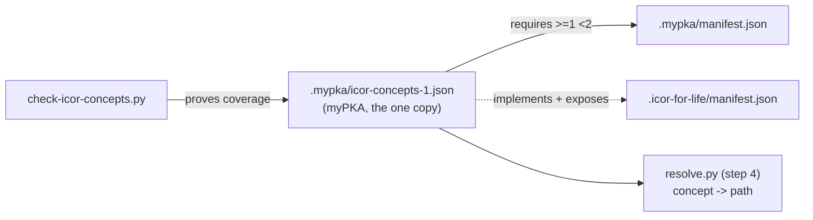

# GL-1014 The icor-concepts schema

myPKA (the team) and a knowledge source (the ICOR for Life scaffold, or any
other) share exactly one contract: `icor-concepts/1`. It lives once, in
myPKA, at `.mypka/icor-concepts-1.json`. Nothing else is shared. The team
addresses **concepts** (`journal`, `projects`, `wip`), never folder paths.
How a concept is bound to a source and resolved: [[GL-1013-sources-and-the-resolver]].
This guideline rules what a concept IS; GL-1013 rules where it is found.

## What the schema holds

| Block | What it says | Built from |
| --- | --- | --- |
| `rooms` | the eight rooms, the question each answers, which side owns it (`source` or `mypka`) | [[GL-1001-the-six-rooms]] |
| `concepts` | 19 content concepts, each with its room, its `default_path` (mode A, relative to the source root), its `slots`, its `max_write_scope` (`none`, `frontmatter`, `full`) and the types it holds | GL-1001, GL-1002, GL-1013 §2.1 |
| `team_concepts` | 15 team concepts (agents, sops, tasks, task_deliverables for ruling k4v, session_logs and the rest): always under the myPKA root, never bound to a source | GL-1013 §2.2 |
| `tools` | the source scripts the team may call through `resolve_tool(name)`; the source manifest maps each name to a path | GL-1013 §2.1 |
| `types` | every GL-1002 type (`side: source`) and every GL-1015 type (`side: team`), each field with `required`, `kind`, enum `values`, relation `target`, and `only_when` for fields meaningful on one sub-kind | [[GL-1002-frontmatter-conventions]], [[GL-1015-team-frontmatter-conventions]] |
| `links` | the wikilink value shape and the link rules (note needs one of projects, key_elements, topics; project needs a goal; document needs its binary) | GL-1002 |
| `versioning` | what may change inside major 1 and what needs `icor-concepts/2` | this guideline |

`side: source` types are the contract a source must honour. `side: team`
types (task, session-log, sop, workstream, guideline, agent and the rest)
are myPKA's own; they are in the schema so one file names every field the
team may write.

## Rules

1. **A source declares, the team checks.** A source's manifest carries
   `implements: icor-concepts/1`, `exposes: [...]` and `tools: {...}`. myPKA refuses a major
   it does not know and reports "degraded" for a concept not exposed.
2. **Mode A never moves.** Every `default_path` is today's folder. Changing
   one is a new major.
3. **No field without the schema.** A new field goes into its guideline
   first, then into the schema, then into use (hard rule: no invented
   frontmatter). A content field (a `side: source` type) goes into
   [[GL-1002-frontmatter-conventions|GL-1002]]; a team field (a `side: team`
   type: task, session-log, sop, workstream, guideline, agent and the rest)
   goes into [[GL-1015-team-frontmatter-conventions|GL-1015]].
   `check-icor-concepts.py` reads both and fails when either disagrees with
   the schema.
4. **Additive inside a major.** New optional fields, new concepts and new enum
   values are minor. Renames, removals, new required fields and narrowed enums
   are `icor-concepts/2`.

## Proving it

Run from the myPKA root with your shell tool:
`python3 "06 AI Team/AI Team Knowledge/Scripts/check-icor-concepts.py"`
(add `--source-root <dir>` in mode B, and `--adr <GL-1013 file>` to prove
the concept ids, homes, slots and scopes match GL-1013's tables). `--self-test` is the negative
control: the clean schema passes, and a dropped required field, a dropped
room, a renamed concept and (with `--adr`) a concept renamed against GL-1013
each fail.
