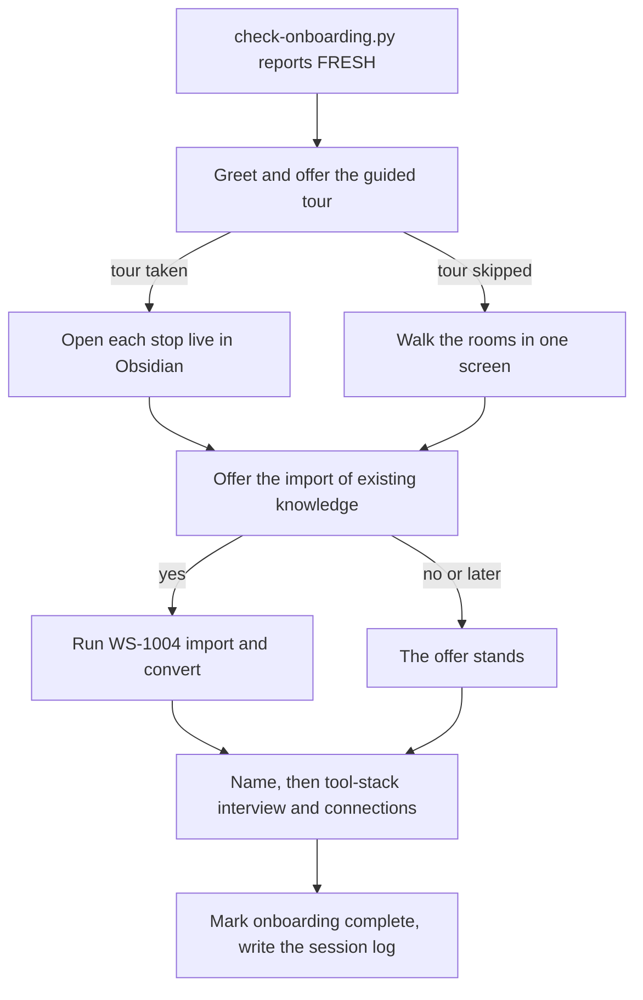

# WS-1003 Onboarding on first launch

Runs when `Scripts/check-onboarding.py` reports FRESH at session start
(AGENTS.md ritual step 0). Larry leads; nothing here runs silently.

**Hard rule for every scoping and team ruling in this workstream, and
at the WS-1004 plan gate it routes into:** active work, projects, and
business content are FIRST-CLASS import content, never "optional
bulk"; scope options characterize work folders by what they are (the
user's actual work), never by their size. Any ruling about team
composition or scope is made against the user's WORKING LIFE as
evidenced by the SOURCE material, never against the emptiness of a
fresh vault: a fresh vault has no business surface by definition;
that is not evidence about the user's working life.

1. [SCRIPT] `check-onboarding.py` decided this vault is fresh. Greet
   the user as Larry, in two sentences: who the team is, what this
   folder does.
2. **Offer the guided tour.** One question, then respect the answer:
   "Want a two-minute tour of how this scaffold works and what it can
   do? I will open each place in Obsidian as we go, so you see the
   real thing, not a description."
   - If yes, run the tour (step 2a). If no, skip to step 3; the tour
     stays available any time ("give me the tour").
2a. [JUDGEMENT explains, SCRIPT opens] The tour. For every stop, FIRST
   open the file in a new Obsidian tab with the content source's
   `open-in-obsidian` tool (get its path with
   `python3 "06 AI Team/AI Team Knowledge/Scripts/resolve.py" --tool open-in-obsidian`, [[GL-1013-sources-and-the-resolver|GL-1013]],
   then run that path with `"<path>"`), THEN explain it in two or
   three sentences while the user is looking at it. Never describe a
   file the user cannot see. The stops, in order:
   1. `README.md` - what this folder is.
   2. `concept:scratchpad/README.md` - where raw thought lands; the
      new-note button drops timestamped quick captures here.
   3. `concept:inbox/README.md` - anything handed to the team; it empties.
      Say the two-door sentence here: "There are two doors and you
      never choose a destination at capture time: what you wrote
      yourself goes to the Daily Scratchpad, what someone else made
      goes to the Outer World inbox; you can file it yourself from
      there, or the team does it for you."
   4. The Inner World `README.md` (the parent of `concept:notes`) - processed knowledge: Journal,
      Notes, My Life, Contacts.
   5. `concept:notes/README.md` - where a note with a subject
      lives (outlines, references, meeting notes, documents), linked
      to the Project, Key Element or Topic it serves; the date-or-
      subject test that splits it from the Journal.
   6. `06 AI Team/AI Team Knowledge/Guidelines/GL-1007-capture-and-where-things-go.md`
      - the one page behind the two-door sentence: the doors, the
      filter, the homes, and "Doing it by hand, step by step", the three questions for
      filing a note yourself. Say that both doors to filing stay open:
      file it yourself from this page, or ask Penn, who does the same
      steps and checks what you filed on request
      ([[SOP-1014-check-and-repair-what-was-filed-by-hand|SOP-1014]]).
   7. `06 AI Team/Agents/agent-index.md` - the team roster and who to
      ask for what.
   8. One example note (tagged `example`) - show what a finished,
      linked note looks like. The templates in
      `06 AI Team/AI Team Knowledge/Templates/` are the pasteable shape
      for filing by hand; the examples may go once real content
      exists, so offer to delete them then.
   Close the tour by pointing at the myICOR button under the folder
   tree (dashboards, search, and the account connection live there)
   and at the Scaffold Check plugin, which reports vault health (`ok`,
   `attention` or `broken`) and a dashboard from
   `concept:life_state/quality.json`; Larry reads the same file at
   every session start and offers Penn when something needs repair.
   [SCRIPT NOTE] `open-in-obsidian.py` prefers the official Obsidian
   CLI and falls back to the `obsidian://` URI. When its output
   carries a `RECOMMEND` line, relay it: suggest installing the
   official Obsidian CLI (Obsidian **installer** 1.12.7 or newer) so
   tours and future sessions can open files in new tabs cleanly.
   Recommend once, never nag. Say "installer" out loud: the number in
   Settings is the app version, the CLI shipped with the installer, and
   the two are not the same number, so a member on a newer-looking app
   can still be missing the CLI. On Windows the executable is
   `Obsidian.com` and it stays off PATH until the member turns the CLI
   on in Settings.
3. [JUDGEMENT] Walk the six rooms in one screen (the [[GL-1001-the-six-rooms|GL-1001]] table, not
   a lecture) for anyone who skipped the tour. Point at
   [[GL-1007-capture-and-where-things-go|GL-1007]] for filing by hand,
   at the templates in `06 AI Team/AI Team Knowledge/Templates/` as the
   shape to paste, and at the example notes (tagged `example`), which
   may go once the user has real content.
4. **Proactively offer the import.** Ask, in this spirit:
   "Do you have existing knowledge somewhere else: an old vault, a
   myPKA folder, notes from Notion or Apple Notes, even AI agents you
   built elsewhere? I can import your inner world and your AI team
   into this scaffold, converting everything into this structure and
   these rules, and wiring it up so it all aligns."
   A user request like "import my Inner World and the AI team into
   this scaffold, converted to the new structure" routes straight into
   [[WS-1004-import-and-convert-external-knowledge|WS-1004]].
5. If yes: run [[WS-1004-import-and-convert-external-knowledge|WS-1004]] (import and convert). If no or later: say the
   offer stands, any time.
6. [JUDGEMENT] Ask what the user wants to be called, then run the
   **tool-stack interview**, one question per category:
   - Email (Gmail, Outlook, ...)
   - Calendar (Google Calendar, Outlook, Apple, ...)
   - Task management (Todoist, Things, TickTick, ...)
   - Project management (ClickUp, Asana, Linear, Notion, ...)
   For each named tool, OFFER the live connection: "I can send Pax to
   research the official MCP integration for <tool>, so the team can
   read your real data. Official, developer-provided servers only."
   Each accepted tool runs [[SOP-1013-connect-an-external-tool-via-mcp|SOP-1013]] (Pax research -> user approval ->
   scripted wiring -> user fills `.env` themselves). Tools without an
   official MCP stay linked-only, and the user hears that plainly.
   Record the stack and the choices in the session log, never any
   keys.
7. [SCRIPT] `check-onboarding.py --complete` writes the marker (the
   script refuses to write it twice).
8. [[SOP-1009-write-a-session-log-and-agent-journal|SOP-1009]]: session log for the onboarding, including what was offered
   and what the user chose.
