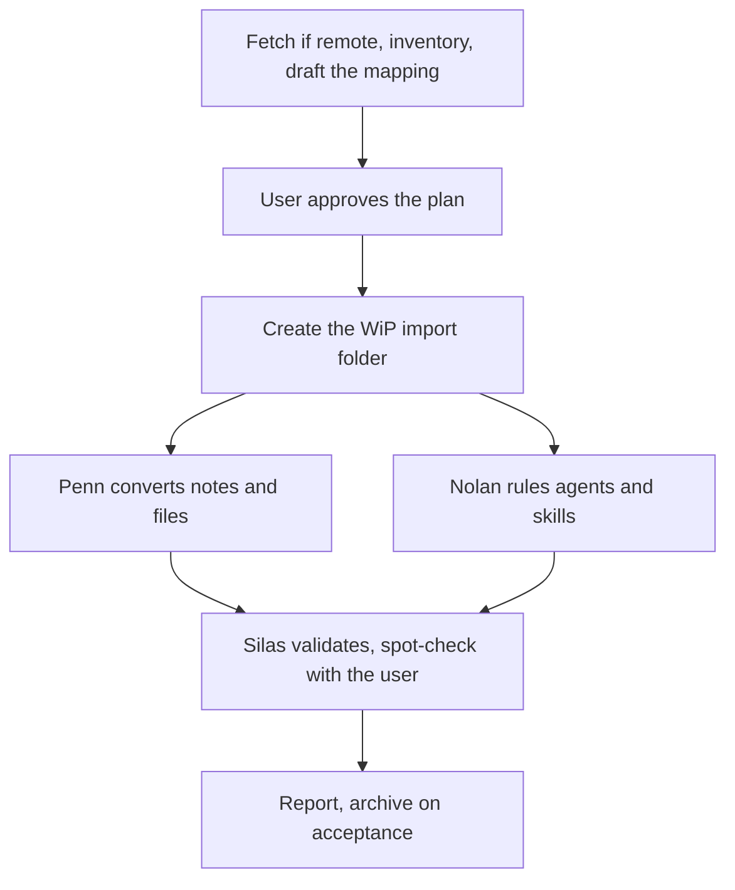

# WS-1004 Import and convert external knowledge

Turns an outside knowledge source (old vault, myPKA folder, exported
notes, foreign agent definitions) into native scaffold content. The
iron rule: **nothing enters the six rooms un-converted.** Foreign
structure, foreign frontmatter, and foreign agent contracts are
translated to THIS scaffold's rules, never copied verbatim.

1. **Plan gate.** A source that sits behind an API or a login rather
   than on disk is fetched first by Mack (the connection half; an MCP
   server goes through [[SOP-1013-connect-an-external-tool-via-mcp|SOP-1013]]) and landed in the WiP
   folder of step 2; the inventory runs on what he landed.
   [SCRIPT] `Scripts/import-inventory.py <source>`
   produces the deterministic inventory: shape (mypka /
   obsidian-vault / markdown-folder), counts, frontmatter keys, agent
   definitions found. [JUDGEMENT] Larry drafts the mapping table from
   it: source area -> target room, per entity type, with counts.
   **The user approves the mapping BEFORE any write.**
   **Hard rule at this gate:** active work, projects, and business
   content are FIRST-CLASS import content, never "optional bulk."
   Scope options characterize work folders by what they are (the
   user's actual work: client projects, content pipelines, open
   deliverables), never by their size. And any ruling about team
   composition or scope, here or in step 4, is made against the
   user's WORKING LIFE as evidenced by the SOURCE material, never
   against the emptiness of a fresh vault: a fresh vault has no
   business surface by definition; that is not evidence about the
   user's working life.
2. [SCRIPT-CHECKED] Create the working folder
   `concept:wip/operations/YYYY-MM-DD-import-<source-slug>/` with `manifest.md`
   ([[SOP-1006-start-work-and-archive-a-wip-folder|SOP-1006]]). Every imported file gets a manifest line.
3. **Content conversion (Penn).** Per approved mapping, [[SOP-1010-convert-an-external-note|SOP-1010]]
   converts each note: scaffold frontmatter ([[GL-1002-frontmatter-conventions|GL-1002]]), naming ([[GL-1004-naming-rules|GL-1004]]),
   right room ([[GL-1001-the-six-rooms|GL-1001]]), wikilinks re-pointed. Binary files ->
   `concept:assets` via `Scripts/import-file.py`, which enforces room
   placement and never overwrites.
4. **Agent alignment (Nolan).** Foreign agent definitions NEVER land
   as-is. [[SOP-1011-import-or-align-an-external-agent|SOP-1011]] rules each one: hire as a new agent through the
   Agent 01 template, merge into an existing agent, or extract its
   knowledge into SOPs/Guidelines and drop the shell.
5. **Skill conversion (Nolan).** Skill packages (SKILL.md, prompt
   recipes, toolkits) are decomposed per [[SOP-1012-convert-an-external-skill|SOP-1012]]: procedures to SOPs,
   code to red-tested Scripts, reference to Guidelines, roles through
   [[SOP-1011-import-or-align-an-external-agent|SOP-1011]], plus a thin `.claude/skills/` shim only when the skill
   must stay invocable by name.
6. **Verification (Silas).** [SCRIPT] The content source's
   `validate-scaffold` tool (the content) and `check-bases` tool, each
   run at the path `python3 "06 AI Team/AI Team Knowledge/Scripts/resolve.py" --tool <name>` prints
   ([[GL-1013-sources-and-the-resolver|GL-1013]]), plus the team's `Scripts/validate-team.py`
   (agents hired or merged), must exit 0. [JUDGEMENT] Silas checks
   every landed note's frontmatter against the approved mapping and
   reports drift. Spot-check three converted notes with the user:
   original vs converted, links working.
7. **Report.** Counts per room, agents hired/merged, what was left
   behind and why. Manifest stays in the WiP folder; the folder
   archives when the user accepts the import ([[SOP-1006-start-work-and-archive-a-wip-folder|SOP-1006]]).

The source is NEVER modified or deleted. An import is a copy plus a
conversion; the user retires the original on their own schedule.

**Every landed file carries its SOURCE's modification time.** ICOR Focus
and every other recency surface read the filesystem mtime, not
frontmatter; a fresh mtime collapses the user's entire history onto
import day (defect observed live 2026-08-28: 340 entities stacked on
"today"). Straight copies keep it automatically (`import-file.py` uses
copy2); converted notes and journal entries pass `--mtime-from <source>`
to the landing script; any file an agent writes directly gets
`touch -r <source> <target>` as the LAST touch (later edits re-stamp it,
so mtime restore is always the final step per file).
